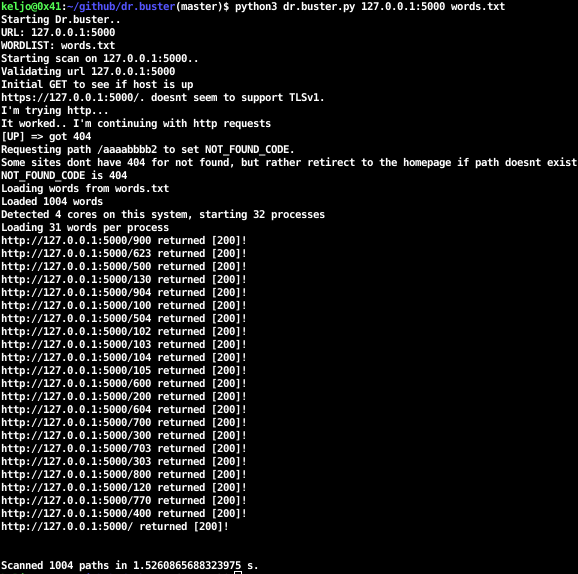

# dr.buster
Simple, yet effective web path finder with Python API and C++ core.

## Getting started
Simplest way to get dr.buster is to install it using pip:

```bash
python3 -m pip install dr_buster
```

Alternatively to install it from the source see the instructions bellow.

Once the module is installed you can run the scan by importing the module and calling the scan function:

```py
from dr_buster.core import start_scan

start_scan(url, wordlist_path)
```

Output in in `url [code]` format will be generated when program finishes.

### CLI usage
Following CLI example starts a scan on example.com with word list found in `/home/user/wordlist.txt`
and generates report `dr.buster.report.$datetime$` in the current working directory.


```
$ python3 -m dr_buster https://example.com /home/user/wordlist.txt
```


*Example output when started with words.txt on testserver*




*Sample report*
```
user@hostname:~/dr.buster$ cat dr.buster.report.09-08-2020_10-54-28 
http://localhost:5000/900 [200]
http://localhost:5000/623 [200]
...
http://localhost:5000/770 [200]
http://localhost:5000/400 [200]
```

### Test it out on testserver
```
$ pip3 install flask
$ export FLASK_APP=tests/testserver.py
$ python3 -m flask run
```
and run dr.buster in another terminal


## Installing from the source
### Prerequisites

<!-- **On Linux** -->

* A compiler with C++11 support
* CMake >= 2.8.12

<!-- **On Windows**

* Visual Studio 2015 (required for all Python versions, see notes below)
* CMake >= 3.1 -->


### Installation

Recursively clone this repository and run pip install. 

```
git clone --recursive https://github.com/kelj0/dr.buster.git
pip install ./dr_buster
```

With the `setup.py` file included in this project, the `pip install` command will
invoke CMake and build the C++ module as specified in `CMakeLists.txt`.


<!-- ## Special notes for Windows

**Compiler requirements**

dr.buster requires a C++11 compliant compiler, i.e Visual Studio 2015 on Windows.
This applies to all Python versions, including 2.7. Unlike regular C extension
modules, it's perfectly fine to compile a dr.buster module with a VS version newer
than the target Python's VS version.

**Runtime requirements**

The Visual C++ 2015 redistributable packages are a runtime requirement for this
project. It can be found [here][vs2015_runtime]. -->


## License

dr.buster is provided under a MIT license that can be found in the LICENSE
file. By using, distributing, or contributing to this project, you agree to the
terms and conditions of this license.


## TODO:
* [-] - create C++ version of dr.buster
* [ ] - output reports to cwd
* [ ] - argsparse option to specify where to output reports


##### DISCLAIMER: I AM NOT RESPONSIBLE FOR ANY ACTIONS DONE WITH THIS SCRIPT, USE IT ONLY IF YOU HAVE PERMISSION